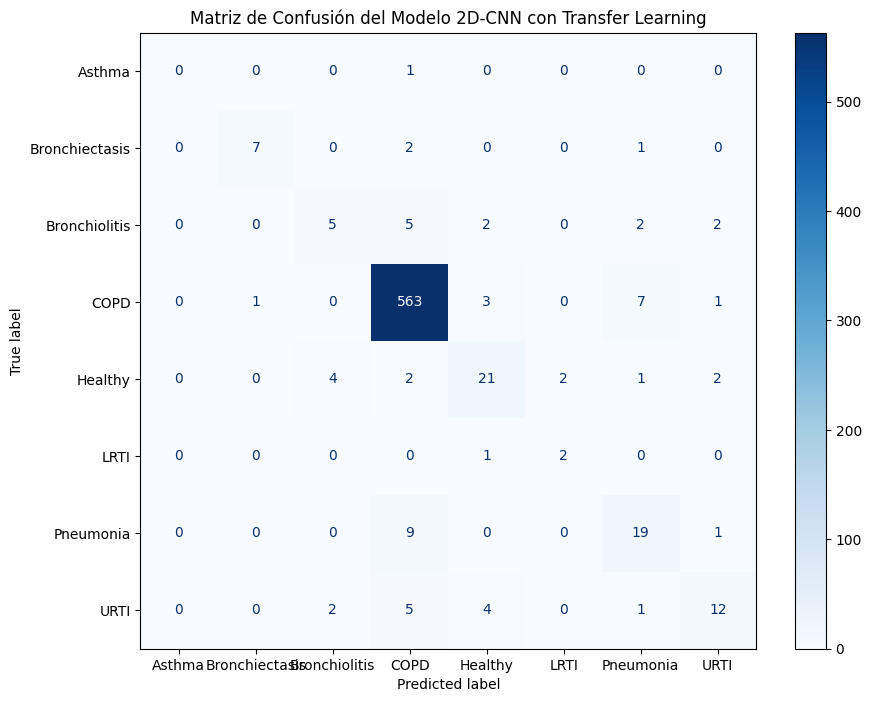
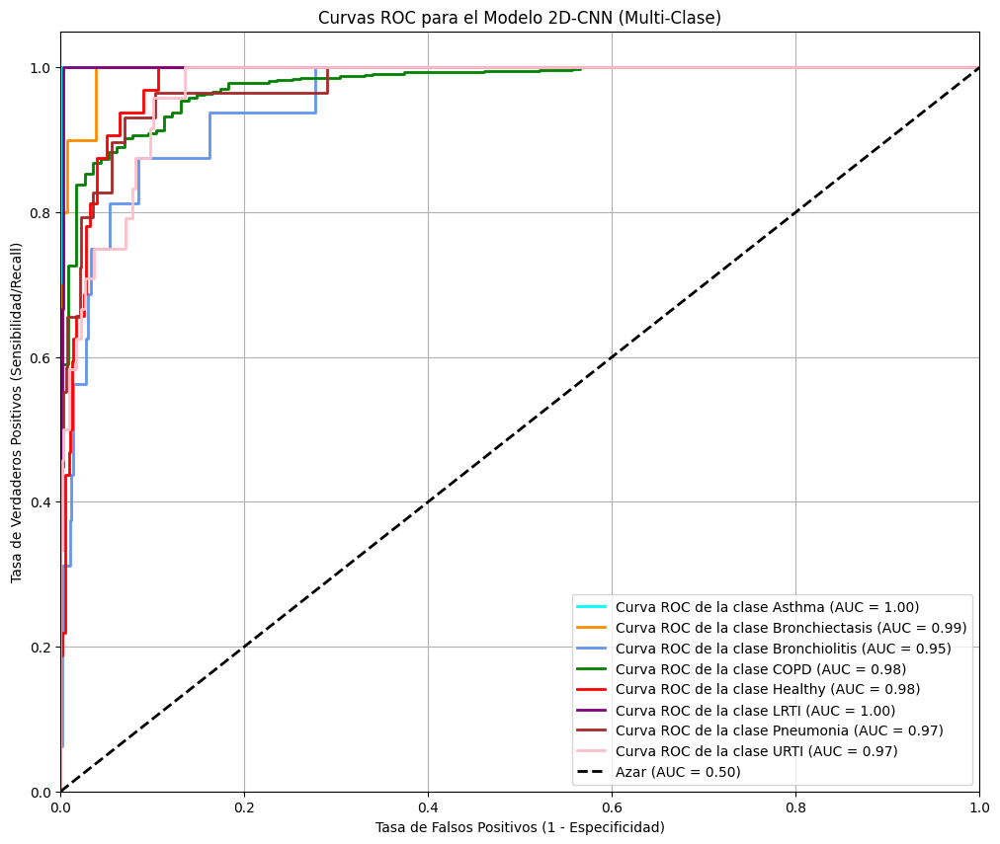

# PROJECT ZERO: Respiratory Sound Classifier for COPD


&#x20;    &#x20;

This repository documents the development of an end-to-end Machine Learning system for classifying respiratory diseases from audio recordings, with a focus on early detection of biomarkers associated with COPD exacerbations.

---

## 🩸 1. Problem & Mission

Chronic Obstructive Pulmonary Disease (COPD) is one of the leading causes of global morbidity and mortality. Acute exacerbations often require hospitalization and are typically preceded by subtle changes in respiratory sounds such as wheezes and crackles.

> 🎯 **Mission:** Develop an intelligent system that analyzes respiratory recordings to predict respiratory conditions and act as an early warning system for COPD patients.

---

## 🧠 2. Solution Architecture

The system is deployed as a containerized API using Docker and FastAPI. The pipeline follows this flow:

**User** → `audio.wav` → `FastAPI endpoint` → `Preprocessing` → `2D-CNN EfficientNet-B0` → `Prediction JSON`

---

## 📊 3. Final Model Results

Three models were trained and compared:

- 🌟 **Random Forest** using MFCC features (baseline)
- 🛠️ **1D-CNN** on raw audio signals
- 🧠 **2D-CNN** with transfer learning on spectrograms (final model)

### Comparison Table

| Model                        | Weighted F1-Score | Accuracy | Recall (Healthy) | Recall (Pneumonia) |
| ---------------------------- | ----------------- | -------- | ---------------- | ------------------ |
| Random Forest (Baseline)     | 0.89              | 0.91     | 0.36             | 0.44               |
| 1D-CNN (Regularized)         | 0.84              | 0.86     | 0.41             | 0.14               |
| ✅ 2D-CNN (Transfer Learning) | **0.91**          | **0.91** | **0.66**         | **0.66**           |

### Visualizations

### Matriz de Confusión del Modelo Ganador


### Curvas ROC-AUC del Modelo Ganador


---

## 🚀 4. Deploy with Docker

This project is deployed as a RESTful microservice.

### Requirements

- Python 3.9
- Docker
- Git

### Steps

```bash
# 1. Clone the repository
git clone https://github.com/GabrielSMurillo/proyecto-cero-epoc.git
cd proyecto_cero

# 2. Build the Docker image
docker build -t respiratory-classifier .

# 3. Run the container
docker run -p 8000:8000 respiratory-classifier
```

### API Access

- Swagger UI: [http://localhost:8000/docs](http://localhost:8000/docs)
- Curl:

```bash
curl -X POST -F "audio_file=@path/to/file.wav" http://localhost:8000/predict
```

---

## 🧪 5. Repository Structure

```
proyecto_cero/
├── data/
│   └── spectrograms/            # Data organized by class
├── models/                      # Trained models (.pth / .joblib)
├── notebooks/                   # Development notebooks
├── src/                         # Inference and training modules
├── tests/                       # Unit tests (incl. API tests)
├── api.py                       # FastAPI app
├── Dockerfile                   # Docker config
├── requirements.txt             # Dependencies
└── README.md
```

---

## 🔬 6. Experimentation & Reproducibility

```bash
# Create virtual environment
python -m venv venv
source venv/bin/activate  # or venv\Scripts\activate on Windows

# Install dependencies
pip install -r requirements.txt
```

Check `/notebooks` to reproduce the full flow of EDA, training, and evaluation.

---

## 📧 Contact

**Gabriel Santiago Murillo Barragán**\
Med Student | Biomedical Engineer\
Universidad de los Andes\
📧 [gabrielsmurillo@uniandes.edu.co](mailto\:gabrielsmurillo@uniandes.edu.co)

---

> 🧠 This project is a proof of concept for smart home monitoring of respiratory conditions. Future work includes integration with wearable devices and Explainable AI (XAI).

